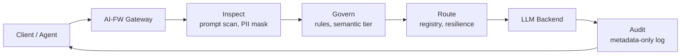
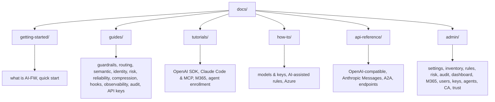

<div align="center">

<picture>
  <source media="(prefers-color-scheme: dark)" srcset="assets/logo-dark.svg">
  
</picture>

# AI-FW
#### The AI Firewall & Governance Gateway

**Every AI agent: identified, authorized, inspected, governed.**

[Documentation](https://aifw.io/docs) · [Website](https://aifw.io) · [Get started](https://aifw.io/get-started) · [Enterprise](https://aifw.io/contact)

[](https://aifw.io)
[](https://aifw.io)
[](https://aifw.io)
[](https://aifw.io)
[](https://aifw.io/docs)
[](https://github.com/securetron-gh/aifw)

</div>

AI-FW is the **AI firewall and governance gateway** between your AI agents and the models they call. Every prompt and response is inspected, governed, and routed, with provable agent identity and regulator-ready audit, all in one process that runs in your own environment.

- [x] **Fail-closed by design**: offline guardrails never delegate to third parties, no traffic while scanning is unhealthy
- [x] **Agents are identities**: A2A protocol, agent registry, mTLS, Kerberos, OIDC SSO, SCIM provisioning
- [x] **Cost savings without safety holes**: semantic-gated prompt compression and inspection-gated caching
- [x] **Audit you can hand to a regulator**: metadata-only transaction log with encrypted export to your SIEM
- [x] **Surfaces others cannot reach**: Claude inference hooks, MCP tool governance, M365 Copilot admin with agent sync
- [x] **Opt-in endpoint gateway**: images, audio, files, fine-tuning, and batches under the same inspection pipeline

## Features

Every feature is documented on [aifw.io/docs](https://aifw.io/docs) and in this repository's `docs/` folder.

| Feature | Doc |
|---|---|
| Prompt & response guardrails | [Guide](https://aifw.io/docs/guides/prompt-response-guardrails) |
| Semantic intent analysis | [Guide](https://aifw.io/docs/guides/semantic-intent-analysis) |
| Model routing & registry | [Guide](https://aifw.io/docs/guides/model-routing) |
| Reliability: retries, failover, distribute | [Guide](https://aifw.io/docs/guides/reliability-caching) |
| Completion cache (exact + semantic) | [Guide](https://aifw.io/docs/guides/reliability-caching) |
| Prompt compression | [Guide](https://aifw.io/docs/guides/prompt-compression) |
| Identity & access (IDAM) | [Guide](https://aifw.io/docs/guides/identity-access) |
| Admin-issued API keys | [Guide](https://aifw.io/docs/guides/agent-api-keys) |
| Risk profiles & auto-block | [Guide](https://aifw.io/docs/guides/risk-profiles) |
| Observability & dashboard | [Guide](https://aifw.io/docs/guides/observability-dashboard) |
| Audit logs & export (syslog / pull API) | [Guide](https://aifw.io/docs/guides/audit-logs-export) |
| Claude inference hooks | [Guide](https://aifw.io/docs/guides/claude-inference-hooks) |
| M365 Copilot admin & agent sync | [Tutorial](https://aifw.io/docs/tutorials/m365-copilot-bridge) |
| Claude Code, Cursor & MCP tools | [Tutorial](https://aifw.io/docs/tutorials/claude-code-cursor-mcp) |
| Agent self-enrollment (CSR + mTLS) | [Tutorial](https://aifw.io/docs/tutorials/agent-self-enrollment) |
| Endpoint gateway (images, audio, files, batches) | [API reference](https://aifw.io/docs/api-reference/openai-compatible-api) |
| A2A agent protocol | [API reference](https://aifw.io/docs/api-reference/a2a-agent-protocol) |
| Fail-open options (opt-in) | [Guardrails guide](https://aifw.io/docs/guides/prompt-response-guardrails) |
| Advanced parameters (parameter policy) | [How-To](https://aifw.io/docs/how-to/configure-models-keys) |
| Admin pages (Settings, Inventory, Rules, Audit, ...) | [Admin reference](https://aifw.io/docs/admin/settings) |
| Supported models & endpoints (200+) | [API reference](https://aifw.io/docs/api-reference/openai-compatible-endpoints) |

> [!WARNING]
> Model IDs change frequently. Always verify against each vendor's live model list before registering a model (see the [models reference](https://aifw.io/docs/api-reference/openai-compatible-endpoints)).

## Quick start

### 1. Run the gateway

```bash
docker run -d --name aifw-gateway -p 443:443 \
  -e ConnectionStrings__Default=Host=your-postgres;Database=aifw;Username=...;Password=... \
  aifw/gateway:latest
```


> [!IMPORTANT]
> The gateway serves HTTPS on port 443 by default. If port 443 is already in use on the host, map a different host port instead, for example `-p 8443:443`.

### 2. Make your first request

```bash
curl https://fqdn.aifw.io/v1/chat/completions \
  -H "Content-Type: application/json" \
  -d '{"model":"gpt-4o","messages":[{"role":"user","content":"Hello!"}]}'
```

Open the gateway at `https://fqdn.aifw.io` and watch the transaction appear in the dashboard.

> [!TIP]
> To route traffic through the gateway, register these backend URLs and models in the AI-FW Model Inventory (see [Configure models and keys](https://aifw.io/docs/how-to/configure-models-keys)).

## How it works

## How it works



1. **Connect** - point any OpenAI-compatible or Anthropic client at the gateway (SDKs, Claude Code, Cursor, MCP tools, or plain HTTP)
2. **Inspect** - every prompt and response is scanned, PII-masked, and semantically scored
3. **Govern** - routing rules, risk profiles, and policy decide what flows and what is blocked
4. **Audit** - metadata-only logs and events record exactly what happened

## Documentation

This repository holds the AI-FW knowledge base. The rendered version lives at [aifw.io/docs](https://aifw.io/docs).



| Section | Topics | Files |
|---|---|---|
| Getting Started | What AI-FW is, quick start | `docs/getting-started/` |
| Guides | Guardrails, routing, semantic analysis, identity, risk, reliability, compression, hooks, observability, audit, API keys | `docs/guides/` |
| Tutorials | OpenAI SDK, Claude Code & MCP, M365 Copilot admin, agent self-enrollment | `docs/tutorials/` |
| How-To | Models & keys, AI-assisted rules, Azure deployment | `docs/how-to/` |
| API Reference | OpenAI-compatible, Anthropic Messages, A2A agent protocol | `docs/api-reference/` |
| Admin Reference | Settings, Model Inventory, Rules Manager, Risk Profiles, Audit, M365, Users, Agents, CA, Agent Trust | `docs/admin/` |

## Enterprise

- ✅ **ISO 27001 certified and SOC2 compliant**
- ✅ **Fail-closed by design** - no traffic while scanning is unhealthy
- ✅ **App-only Microsoft 365 Copilot integration** with agent sync
- ✅ **Role-based access control, OIDC SSO, and SCIM provisioning**
- ✅ **Encrypted audit export** to your SIEM (syslog over TLS)
- ✅ **Self-hosted** in your environment with no per-token fees

[Book a demo](https://aifw.io/contact) or [get started](https://aifw.io/get-started).

## Security

To report a security issue, contact us at [aifw.io/contact](https://aifw.io/contact).

## Contributing

PRs are welcome.

We would also like to thank the Securetron.net team for their continued support in helping the community.
